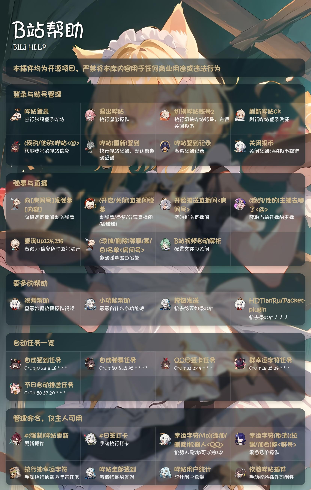
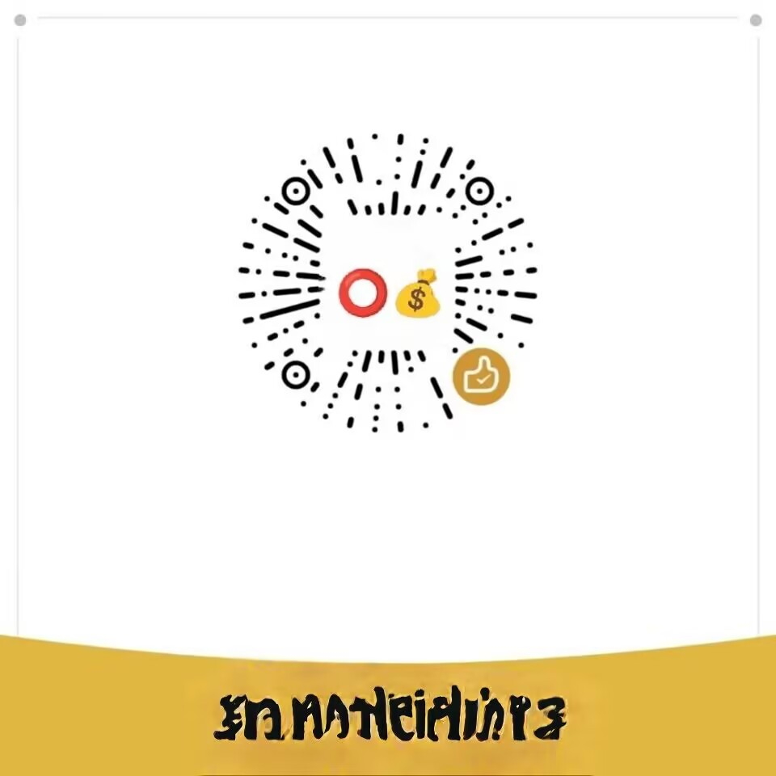

<div align="center">

# [NenNen_CN](https://gitee.com/nennen-cn)


</div>

## ⚠️ 本插件含有较多内容，请阅读以下文本再使用本插件

> **请务必阅读以下内容后再使用本插件**  
> 🚫 小吉祥教不准骂我！  
> 🔍 需要具备正常使用搜索引擎的能力  
> 🛠️ 掌握基础文件修改技能  
> 🧠 具有义务教育阶段的知识水平  
> 💻 对Yunzai框架有基本认知  

❌ **如不满足以上要求**：  
请立即停止安装并关闭页面 → [快速挂号通道](https://www.guahao.com/nav)


---

## 🎯 功能说明
- 全面适配 [TRSS Yunzai v3.1.3](https://github.com/TimeRainStarSky/Yunzai)
- 兼容 [Miao-Yunzai v3.1.3](https://github.com/yoimiya-kokomi/Miao-Yunzai)
- 支持B站账号管理/签到/直播监听等30+功能
- 如有问题请前往[群聊](https://qm.qq.com/q/h5g1zIyWTS)反馈

---

## 🛠️ 安装指南

#### Yunzai 根目录执行命令安装

 - GitHub 源
``` bash 
git clone --depth=1 https://github.com/miltrbefr/Bili-Plugin.git ./plugins/Bili-Plugin/
```
> [!NOTE]
> 如果你的网络环境较差，无法连接到 Github，可以使用 [守夜人](https://gitee.com/xh11111111) 提供的文件代理加速下载服务
>
> ```
> git clone --depth=1 https://gh.xiaohuanya.top/https://github.com/miltrbefr/Bili-Plugin.git ./plugins/Bili-Plugin/
> ```

 - 安装依赖
``` bash 
pnpm install --filter=bili-plugin
```
---

## 📖 使用说明

> [!NOTE]
>使用 `#B站功能` 获取完整帮助

| 分类         | 示例                          |
|------------------|-----------------------------------|
| 核心功能         | `B站登录` `我的B站`  `B站签到`  |
| 直播间功能        | `发送弹幕`  `监听直播间所有信息` |
| Bot帮助         |  `日签打卡` `自动群幸运字符` `发送按钮` `官机发送链接`|
| 视频帮助         | `快捷操作视频(点赞/收藏等)` `快捷关注UP` |
| 小功能帮助         | `今日运势` `节日/报时推送`  `娶群友小游戏`    |



---

## ⚖️ 免责声明
>1. 本插件均为开源项目，严禁将本库内容用于任何商业用途或违法行为
>2. 素材均来自于网络，仅供交流学习使用，如有侵权请联系，会立即删除
>3. 请勿将本插件内容上传至视频平台，例如: BiliBili 等

---

## 致谢

| Nickname | Contribution |
| -------- | ------------ |
| [Miao-Yunzai](https://github.com/yoimiya-kokomi/Miao-Yunzai) | 喵喵的 Miao-Yunzai |
| [TRSS Yunzai](https://github.com/TimeRainStarSky/Yunzai) | 食欲的 TRSS Yunzai |
| [TRSS-Plugin](https://gitee.com/TimeRainStarSky/TRSS-Plugin) | 食欲的吴迪插件 |
| [QQBot-Plugin](https://gitee.com/xiaoye12123/Yunzai-QQBot-Plugin) | 小叶的Yunzai-QQBot-Plugin |
| [Packet-plugin](https://gitee.com/HDTianRu/Packet-plugin) | 天如的吴迪插件 🔥🌲去点star|
| [哔哩哔哩 - API 收集整理](https://github.com/SocialSisterYi/bilibili-API-collect) | 哔哩哔哩 - API 收集整理 |


## 联系方式
1. QQ: 1514664085
2. QQ群: 470225982

## 赞助

<details>
<summary>赞赏码 以及 感谢投喂 </summary>

